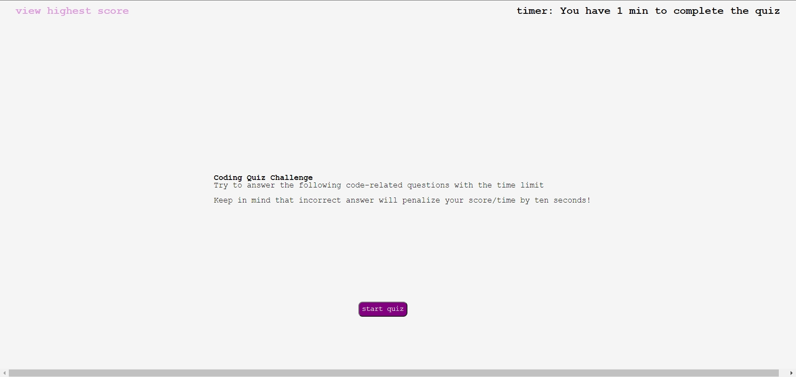

# bootcamp-challenge-04
# bootcamp-challenge-04
WHEN load the page 
THEN can choose to see the previous score or start the quiz. User has 1 mins to do the quiz 
WHEN start the quiz 
THEN the clock on the right corner start to count down and you can choose four options based on the question 
WHEN showing the question you can choose the answer 
THEN if answer is correct showing correct if wrong showing wrong 
WHEN finish all questions 
THEN bring to the submit page, which ask initals and add score  
WHEN submit the inital and score 
THEN show the scores 
WHEN on the score page 
THEN cam choose between go back to main page or clear all the scores in localstorage 

